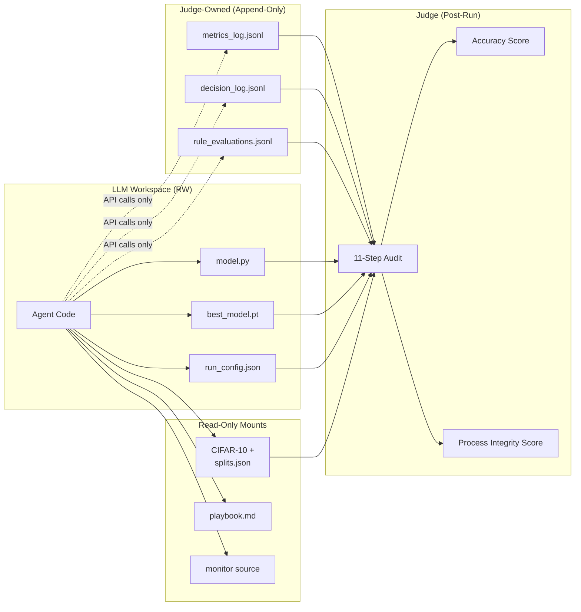

# env_rl — RL Evaluation Environment for Disciplined Model Training

A hermetic RL environment that trains an LLM to train a PyTorch CNN on CIFAR-10 under a fixed 7-rule diagnostic playbook. The LLM is scored on two independent, non-tradeable axes: final-model accuracy and process discipline. Every training decision is captured live by a judge-controlled monitor so the run can be audited end-to-end — the cheapest path to a high combined score is to train honestly and log through the monitor exactly as specified.

See `Project env rl.md` for the full design.

## Architecture



**Trust boundary:** the agent never writes to `/judge_logs/` directly — filesystem permissions plus the `monitor` API are the only route.

## The 7 Rules

| ID | Name | Signal | Precedence |
|----|------|--------|------------|
| R1 | Learning rate | update-to-param ratio EMA out of [1e-4, 1e-2] for 3 epochs, or val-loss plateau | Tuning |
| R2 | Batch size | grad noise scale EMA outside [50, 5000] for 3 epochs | Tuning |
| R3 | Early stopping | val loss no improvement of `min_delta` over `patience` epochs | Process |
| R4 | Depth | train-acc delta < `saturation_gap` for 3 epochs | Capacity |
| R5 | Activations | dead-ReLU fraction EMA > 0.40 for 3 epochs | Capacity |
| R6 | Vanishing gradients | min per-layer grad-norm EMA < 1e-5 for 3 epochs | Stability |
| R7 | Exploding gradients | max per-layer grad-norm EMA > 10.0 for 3 epochs, or NaN/Inf loss | Stability |

**Conflict precedence when multiple rules fire:** `stability > capacity > tuning > process`. A decision citing a deferred rule uses justification `"deferred_to_R<N>"`.

## Quickstart

```bash
poetry install
poetry run pytest tests/unit/ -v                  # 142 unit tests
poetry run pytest tests/integration/ -v           # 6 integration + cheat tests

# Build the split manifest once (seed=42)
poetry run python -m env_rl.data.splits --seed 42 --out data/cifar10/splits.json

# Synthetic smoke run (no CIFAR download needed)
poetry run python examples/run_reference_agent.py --synthetic --epochs 2

# Real CIFAR-10 (requires torchvision-downloaded dataset at ./data/cifar10/)
poetry run python examples/run_reference_agent.py --epochs 20 --lr 0.1
```

The reference agent writes three deliverables to `./workspace/` and three append-only logs to `./judge_logs/`. The judge reads only the latter.

## Scoring

The judge runs 11 steps in strict order. Steps 1–7 are hard-fail gates (zero both scores); steps 8–9 produce process violations (reduce process score only); step 10 runs test-set evaluation; step 11 emits two decoupled scores.

```
accuracy_score = test_accuracy / target_acc      if test_accuracy < target_acc
               = 1.0                              otherwise (saturating)

process_score  = 1 - violations / total_decisions
               = 1.0                              if total_decisions == 0 (see note below)
```

**Denominator-gaming caveat:** if no rule ever fires (a textbook vanilla run), `0 / 0` conventionally saturates to 1.0 — the process axis does not actually measure anything on that run. A future revision could require a minimum number of rule evaluations before the process score is valid.

## Layout

```
src/env_rl/
├── monitor/    only legitimate logging path (hooks, rules, hash-chained logs)
├── judge/      post-run 11-step audit + two-axis scoring
├── data/       CIFAR-10 splits + loaders (test split held out)
├── agent/      reference CNN + training loop (policy-pluggable)
└── harness/    OpenAI-backed LLM decision agent + iterative self-refine
conf/           Hydra configs (monitor, judge, training)
docs/           playbook.md — the 7-rule contract
tests/
├── unit/       154 tests across monitor/judge/data/agent/harness
└── integration/ 6 end-to-end + cheat-attempt tests
examples/       CLI entrypoints (reference + LLM agent)
```

## Running with a real LLM (OpenAI API)

The `harness/` module plugs an OpenAI model in as the decision-maker. Python
drives the training loop; when a rule fires, the LLM is called with the
diagnostic state and returns a structured decision (`event_type`, `cites`,
`justification`, `remedy_direction`, `remedy_params`). Between attempts, the
next attempt's system prompt carries the prior attempts' scores and violation
list.

**This is iterative self-refine, not RL.** Model weights never change — all
"learning" lives in the prompt and is discarded when the conversation ends.
See README section "Scoring" for why, and `Project env rl.md` §12 for the
denominator-gaming caveat.

```bash
export OPENAI_API_KEY=sk-...
poetry run python examples/run_llm_agent.py \
    --attempts 3 --epochs 3 --synthetic --model gpt-4o-mini
```

Output:

```json
{
  "best_attempt": 3,
  "best_scores": { "accuracy_score": 0.5, "process_score": 1.0, ... },
  "all_attempts": [
    { "index": 1, "accuracy_score": 0.2, "process_score": 0.5, ... },
    { "index": 2, "accuracy_score": 0.3, "process_score": 0.8, ... },
    { "index": 3, "accuracy_score": 0.5, "process_score": 1.0, ... }
  ]
}
```

Each attempt's workspace, logs, and scores are persisted under
`./llm_runs/attempt_NN/` so you can inspect exactly what the LLM decided and
how the judge graded it.

## Verification

```
$ poetry run pytest
============================== 148 passed in 2.81s ==============================
```

The cheat-attempt integration suite specifically covers:

| Cheat | Judge response |
|---|---|
| Shadow log written into `/workspace/` | Ignored (judge reads only `/judge_logs/`) |
| Train model A, submit model B | Hard fail (architecture replay mismatch) |
| Forge a past log line (tamper hash) | Hard fail (chain verification) |
| Fabricate trajectory (submit zero-weight model) | Hard fail (live diagnostic sanity) |
| Skip a decision when a rule fired | Process score drops by `1 / total_decisions` |

## Design Doc

`Project env rl.md` — rationale for each component and the integrity story.

## Related

Implementation plan: `/home/zubair-ashfaque/.claude/plans/plan-the-project-make-optimized-squirrel.md`
