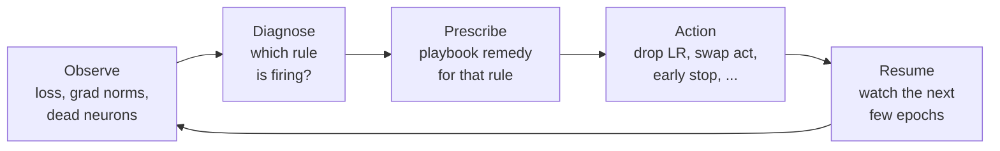
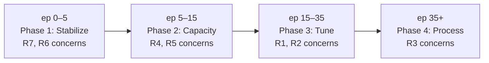
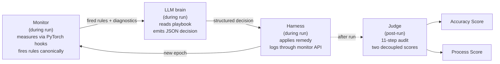
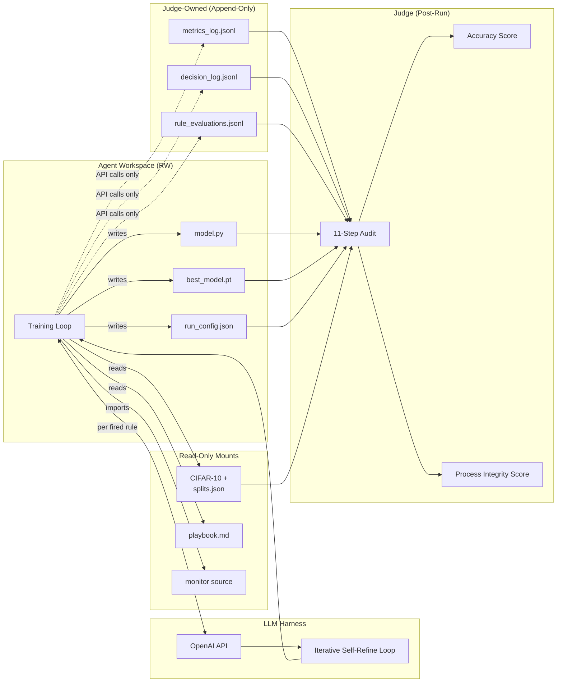
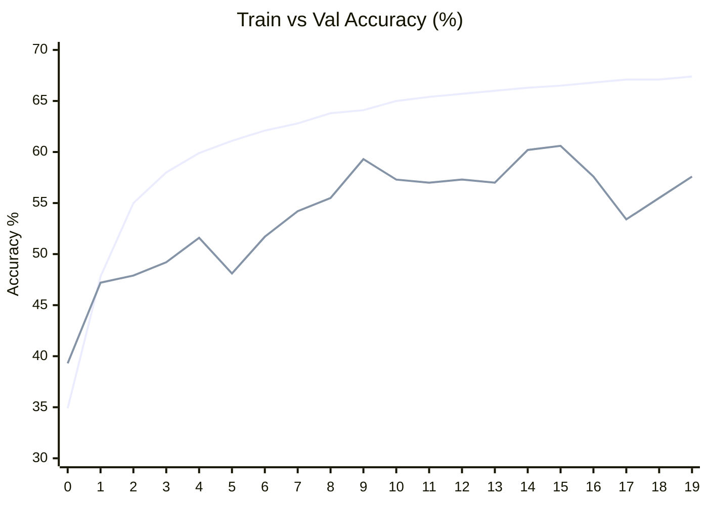
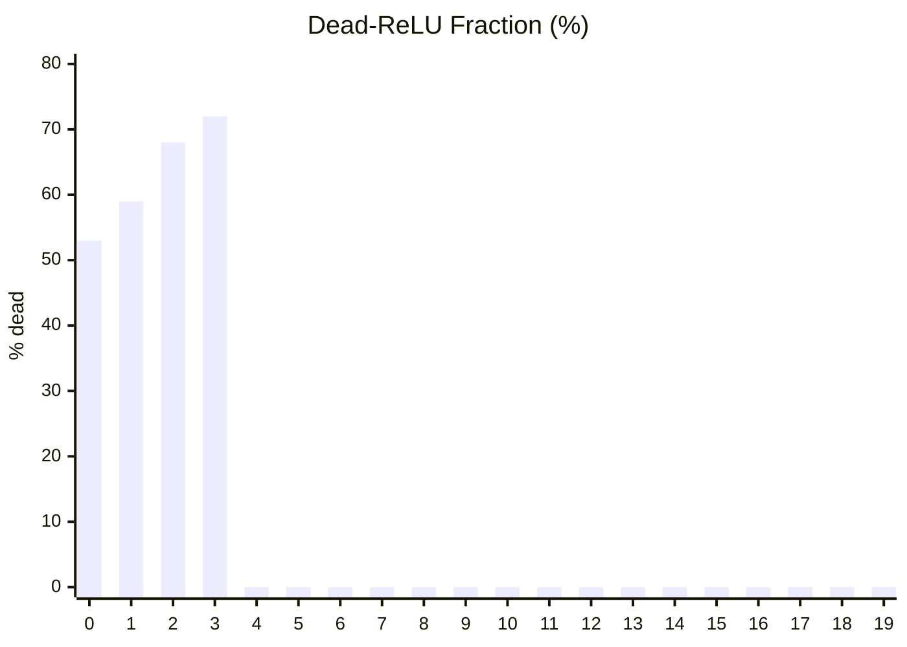
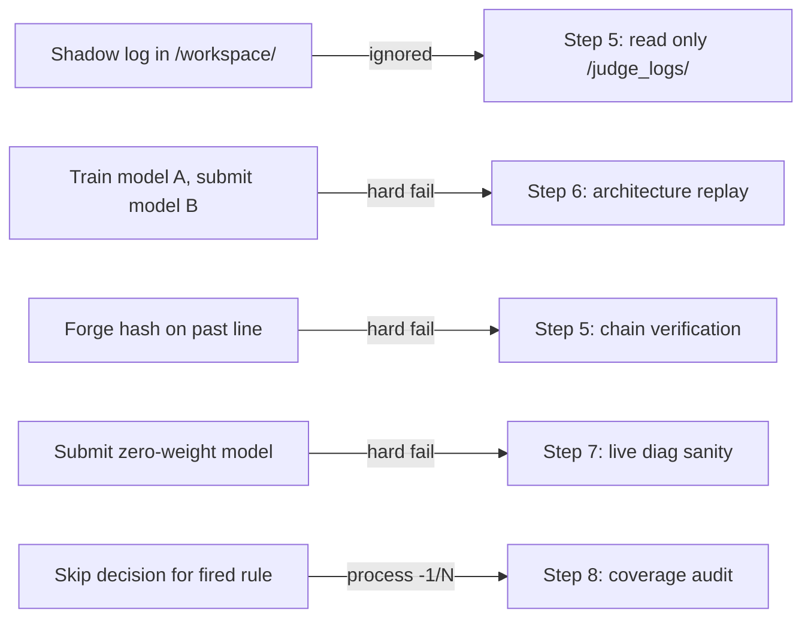

# env_rl — RL Evaluation Environment for Disciplined Model Training

> An RL-style environment that trains an LLM to train a PyTorch CNN on CIFAR-10 under a fixed **7-rule diagnostic playbook**, with a judge-monitored integrity system that scores the LLM on two independent, non-tradeable axes: **final-model accuracy** and **process discipline**.

<p align="center">
  <a href="https://github.com/zubairashfaque/environment_rl"></a>
  
  
  
  
</p>

| | |
|---|---|
| 📖 **Design doc** | [`Project env rl.md`](./Project%20env%20rl.md) |
| 📋 **7-rule playbook** | [`docs/playbook.md`](./docs/playbook.md) |
| 🤖 **LLM setup guide** | [`docs/setup-llm.md`](./docs/setup-llm.md) |
| 🏗️ **Implementation plan** | `~/.claude/plans/plan-the-project-make-optimized-squirrel.md` |
| ✍️ **Blog post** | https://zubairashfaque.github.io/blog/env-rl-disciplined-training.html |

---

## Table of Contents

1. [What this is](#what-this-is)
2. [The Engineer's Invisible Playbook](#the-engineers-invisible-playbook)
3. [Seven Rules, Seven Real Scenarios](#seven-rules-seven-real-scenarios)
4. [Enter the LLM — the brain that watches the logs](#enter-the-llm--the-brain-that-watches-the-logs)
5. [Architecture](#architecture)
6. [The 7 rules at a glance](#the-7-rules-at-a-glance)
7. [Prerequisites](#prerequisites)
8. [Step-by-step setup](#step-by-step-setup)
9. [Running the project](#running-the-project)
10. [A Real Run, Narrated — Three Acts on CIFAR-10](#a-real-run-narrated--three-acts-on-cifar-10)
11. [Per-attempt output files — what everything means](#per-attempt-output-files--what-everything-means)
12. [Inspecting a run with `show_full_run.py`](#inspecting-a-run-with-show_full_runpy)
13. [Understanding the scores](#understanding-the-scores)
14. [Cheat-attempt defenses](#cheat-attempt-defenses)
15. [Tuning & knobs](#tuning--knobs)
16. [Troubleshooting](#troubleshooting)
17. [Running the test suite](#running-the-test-suite)
18. [Project layout](#project-layout)
19. [Why this is "Iterative Self-Refine," not RL](#why-this-is-iterative-self-refine-not-rl)
20. [Contributing / extending](#contributing--extending)

---

## What this is

Training a deep learning model well isn't the training loop — it's the **hundreds of judgment calls** you make during it. Those calls are the hardest to audit and easiest to fake after the fact. `env_rl` closes that gap by making the LLM a *decision-maker* with an independent observer auditing every decision.

**Key numbers:**

| Metric | Value |
|---|---|
| Tests passing | **162** |
| Diagnostic rules | **7** (R1–R7) |
| Judge audit steps | **11** (7 hard-fail gates + 2 process + 2 scoring) |
| Cheat-attempt defenses | **5** (shadow log, model swap, trajectory forge, skipped decision, forged log line) |
| Typical decisions per run | 20–60 |
| Cost per attempt (`gpt-4o-mini`) | ~**\$0.01** |

---

## The Engineer's Invisible Playbook

Go and sit behind any senior ML engineer while they train a model. What you will see is not a person writing clever PyTorch code. What you will see is a person **reading logs**. They are watching training loss tick down, val loss tick sideways, gradient norms drift up. They are running a checklist in their head that nobody ever wrote down — a checklist with rules like:

- *"If val loss stops improving for 5 epochs, stop or decay the learning rate."*
- *"If gradients are exploding, clip them and drop the LR."*
- *"If half my neurons are dead, swap ReLU for LeakyReLU."*
- *"If train accuracy is capped and gradients are clean, I need more capacity."*
- *"If batch size is too small, gradients are too noisy — make the batch bigger."*
- *"If training is memorising the data, regularise or simplify."*

That checklist is a **knowledge base**. Senior engineers carry it around as tacit knowledge. It is the thing that separates a good run from a mediocre one. It is the thing that is hardest to pass on in a textbook, because the value is not in the rule itself — the value is in *applying the right rule at the right moment, looking at the right signal*.

### The senior engineer's training loop — the thing the loss curve does not show



Every 1–3 epochs the engineer runs this loop. Over a 40-epoch run that is **20+ judgment calls**. The model improves because the decisions are good, not because the loop is clever.

## Seven Rules, Seven Real Scenarios

In env_rl, this tacit knowledge gets **written down**. Seven rules cover the levers that matter most during training. Each one has a symptom you can measure from the live model, a cause you can attribute, and a remedy you can execute. Here is what each rule looks like in practice.

| Rule | The scenario you have lived through | Decision logged |
|---|---|---|
| **R1** LR | *"Loss is bouncing around like a pinball."* Update-to-param ratio EMA is 5×10⁻² — ten times healthy. | `hyperparameter_change` · cites R1 · `decrease_lr` · `lr_new = lr/3` |
| **R2** batch size | *"Gradients are too noisy to trust."* Grad noise scale is 12, healthy band is [50, 5000]. | `hyperparameter_change` · cites R2 · `increase_batch_size` |
| **R3** early stop | *"Train still improving; val flat for 5 epochs."* Model is memorising. | `hyperparameter_change` · cites R3 · `stop` |
| **R4** depth | *"Train-acc stuck 70–71% for 4 epochs; gradients clean; activations healthy."* Out of capacity. | `architecture_change` · cites R4 · `add_block` |
| **R5** activations | *"68% of ReLUs stuck at zero for 3 epochs."* Half the model is dead code. | `architecture_change` · cites R5 · `swap_activation → leaky_relu` |
| **R6** vanishing | *"Layer-1 grad norm 1×10⁻⁶ while last layer is 0.5."* Signal never reaches early layers. | `architecture_change` · cites R6 · `add_bn_or_residual` |
| **R7** exploding | *"Grad norm 14.2 for 3 epochs, then loss printed `nan`."* Step size blew up. | `hyperparameter_change` · cites R7 · `decrease_lr` · `lr_new = lr/10` |

R7 has the **highest** precedence — if any other rule fires at the same epoch, it waits.

### Strategy revamp — the same rules, different phase

A good engineer does not apply one rule once. They re-evaluate the whole strategy at key checkpoints. The same rules operate throughout a run, but the *dominant concern* shifts with phase — and the precedence ordering `stability > capacity > tuning > process` roughly tracks which phase you should be in.



## Enter the LLM — the brain that watches the logs

What if **instead of a senior engineer reading the logs**, you had an LLM doing it? The LLM has read thousands of training papers. It knows what a dead ReLU is. It can read a playbook, interpret a diagnostic, and pick an action in seconds. And unlike a human, it does not get tired at epoch 20 and miss the signal at epoch 21.

At every epoch, the monitor hands the LLM the current diagnostic state and any fired rules. The LLM returns a structured JSON decision: *"here is the event type, the rule I am citing, my remedy direction, my justification"*. The harness applies the remedy. Training resumes. The LLM has just taken one of the hundreds of judgment calls a senior engineer would have taken — except every one of its decisions is **logged in a tamper-evident record**.

| | Senior engineer at the terminal | LLM behind env_rl |
|---|---|---|
| Knowledge | Tacit; no two engineers agree | Explicit playbook, same every run |
| Decision record | Post-hoc notes from memory | Logged live, hash-chained |
| Consistency | Gets tired late in a run | Epoch 1 and epoch 40 feel the same |
| Parallelism | One experiment at a time | Trivially parallel; ~\$0.01/run in tokens |
| Auditability | Invisible to any benchmark | Every decision scored by an 11-step audit |

### The full loop — monitor, LLM, judge



During the run: monitor measures, LLM decides, harness executes. After the run: judge reconstructs the whole story from the logs and emits two decoupled scores. **The LLM is never the judge; the judge is never the LLM.** Their independence is the point.

This is why the project is called *env_rl*. It is an **environment** in the RL sense: a world that presents observations to an agent, accepts the agent's actions, and hands back a reward. The observations are live diagnostics. The actions are playbook decisions. The reward is two-axis (accuracy + process). The agent, today, is an OpenAI model operating in an in-context self-refine loop. Future work could train a real RL policy on top — but the environment half, the hard part, is what this repo is.

---

## Architecture



**Trust boundary:** the dashed arrows go *through* the `monitor` API — the agent never writes to `/judge_logs/` directly.

### Four components

```
src/env_rl/
├── monitor/     Owns /judge_logs/. PyTorch hooks. Canonical rule evaluator. Hash-chained writer.
├── judge/       Post-run 11-step audit. Two-axis scoring. Architecture replay. Live-diag sanity.
├── data/        CIFAR-10 deterministic splits (seed=42). Held-out test split.
├── agent/       ResidualCNN meeting the model contract. Pluggable training loop.
└── harness/     OpenAI-backed DecisionPolicy + iterative feedback loop.
```

---

## The 7 rules at a glance

The LLM's job is to respond correctly when each rule fires. Rules are evaluated by a single canonical `evaluate_rules()` — the LLM does not get a vote on whether a rule fired, only what to do about it.

| ID | Name | Signal | Precedence |
|---|---|---|---|
| **R7** | Exploding gradients | max per-layer grad-norm EMA > 10 for 3 epochs, or NaN/Inf loss | **Stability** (highest) |
| **R6** | Vanishing gradients | min per-layer grad-norm EMA < 1e-5 for 3 epochs | **Stability** |
| **R5** | Dead activations | dead-ReLU fraction EMA > 0.40 for 3 epochs | Capacity |
| **R4** | Depth / capacity | train-acc delta < saturation_gap for 3 epochs | Capacity |
| **R1** | Learning rate | update-to-param ratio EMA out of [1e-4, 1e-2], or val-loss plateau | Tuning |
| **R2** | Batch size | gradient noise scale EMA outside [50, 5000] for 3 epochs | Tuning |
| **R3** | Early stopping | val loss no improvement over patience window | **Process** (lowest) |

**Conflict precedence when multiple fire:** `stability > capacity > tuning > process`. Action the highest-precedence rule; defer the rest with `"deferred_to_R<N>"`.

Full rule definitions with symptoms / cause / remedy / caveat live in [`docs/playbook.md`](./docs/playbook.md).

---

## Prerequisites

| Requirement | Version | Why |
|---|---|---|
| Python | 3.11+ | Type syntax, dataclasses |
| Poetry | 2.0+ | Dependency management |
| `git` | any | Cloning / version control |
| Disk | ~2 GB | PyTorch wheels + CIFAR-10 |
| RAM | 4 GB | CPU-only training |
| GPU | optional | Faster real-data runs |
| OpenAI API key | optional | Only for LLM harness (not for scripted agent) |

Check what you have:

```bash
python3 --version        # 3.11 or newer
poetry --version         # 2.0+
git --version            # any recent
```

If Poetry isn't installed:
```bash
curl -sSL https://install.python-poetry.org | python3 -
export PATH="$HOME/.local/bin:$PATH"
```

---

## Step-by-step setup

### Step 1 — Clone the repository

```bash
cd ~/GitHubProject          # or anywhere you like
git clone https://github.com/zubairashfaque/environment_rl.git
cd environment_rl
```

### Step 2 — Install dependencies

```bash
export PATH="$HOME/.local/bin:$PATH"     # if poetry not on PATH
poetry install
```

First install takes ~1–3 minutes (torch is the heavy one). Verify:

```bash
poetry run python -c "import torch; import openai; print('ok')"
# ok
```

### Step 3 — Run the test suite

```bash
poetry run pytest -q
# ... (takes ~3 seconds)
# 162 passed
```

If this isn't green, stop — something is off with your install.

### Step 4 — Set your OpenAI API key (optional, only for the LLM harness)

Skip this step if you only want to run the scripted reference agent.

**Easiest — per-shell export:**
```bash
export OPENAI_API_KEY=sk-proj-your-actual-key-here
echo $OPENAI_API_KEY | cut -c1-10   # verify (shows first 10 chars)
```

**Per-project `.env` file (survives across shells):**
```bash
echo 'OPENAI_API_KEY=sk-proj-your-actual-key-here' > .env
export $(grep -v '^#' .env | xargs)
```

`.gitignore` already excludes `.env` from git. Full guide in [`docs/setup-llm.md`](./docs/setup-llm.md).

### Step 5 — Download CIFAR-10 (optional — only if running without `--synthetic`)

```bash
# ~170 MB, ~1-3 minute download
poetry run python -c "from torchvision import datasets; datasets.CIFAR10(root='./data/cifar10', train=True, download=True); datasets.CIFAR10(root='./data/cifar10', train=False, download=True)"
```

### Step 6 — Build the deterministic split manifest

```bash
poetry run python -m env_rl.data.splits --seed 42 --out data/cifar10/splits.json
# wrote data/cifar10/splits.json (train=45000, val=5000)
```

You're ready to run.

---

## Running the project

Three ways to run, in increasing realism:

### 6.1 Synthetic smoke test (no CIFAR download)

Fastest path. Uses random tensors. No real training; only verifies the plumbing works end-to-end.

```bash
poetry run python examples/run_llm_agent.py --synthetic --attempts 3 --epochs 8 --model gpt-4o-mini --base-dir ./llm_runs
```

**Expected output:**
```json
{
  "mode": "iterative_self_refine",
  "best_attempt": 2,
  "best_scores": {
    "accuracy_score": 0.625,
    "process_score": 0.65,
    "hard_fail": false,
    "test_accuracy": 0.125,
    "violations": 7,
    "total_decisions": 20
  },
  "all_attempts": [...]
}
```

Time: ~30 seconds. Cost: ~\$0.01.

Test accuracy stays at ~0.125 (chance-level on 10-class random data) — that's expected, synthetic data has no pattern to learn.

### 6.2 Real CIFAR-10 with an OpenAI model

Real training, real LLM-driven decisions. Accuracy will actually climb.

```bash
poetry run python examples/run_llm_agent.py --attempts 3 --epochs 20 --batch-size 128 --lr 0.05 --model gpt-4o-mini --target-acc 0.70 --base-dir ./llm_runs_real
```

**Expected output:**
```json
{
  "best_scores": {
    "accuracy_score": 0.86,
    "process_score": 0.65,
    "hard_fail": false,
    "test_accuracy": 0.60,
    "violations": 18,
    "total_decisions": 55
  }
}
```

Time: ~10–20 min on CPU, ~3–5 min on GPU. Cost: ~\$0.05 per run with `gpt-4o-mini`.

> **Note on the rules:** R2, R3, R4, R6 are *waived* in the default reference harness (it can't rebuild the DataLoader mid-run, add blocks to the optimizer, or retrofit BatchNorm). R1, R5, R7 are *active*. The judge treats waived firings as advisory — no process penalty for deferring them. See [`docs/setup-llm.md`](./docs/setup-llm.md#internals) for why.

### 6.3 The scripted reference agent (no API key)

Runs the hard-coded baseline policy — good for CI, integration testing, and a sanity check without spending tokens.

```bash
poetry run python examples/run_reference_agent.py --synthetic --epochs 3 --batch-size 16 --workspace /tmp/ref/workspace --judge-logs /tmp/ref/judge_logs
# {"best_val_acc": 0.094, "final_epoch": 2}
```

No API key needed. This is what the plan calls "a scripted demonstrator that proves the monitor and judge function correctly end-to-end."

---

## A Real Run, Narrated — Three Acts on CIFAR-10

This is the raw story of one real run, extracted verbatim from `llm_runs_real/attempt_01/training_trace.jsonl`:

```bash
poetry run python examples/run_llm_agent.py \
    --attempts 1 --epochs 20 --batch-size 128 --lr 0.05 \
    --model gpt-4o-mini --target-acc 0.70 --base-dir llm_runs_real
```

**Final scores:** `test_accuracy=0.627`, `accuracy_score=0.895`, `process_score=0.627` (19 violations / 51 decisions, no hard fails).

### Act I — Half-Dead on Arrival (epochs 0–1)

The CNN starts with ReLU activations. First forward pass: **53% of neurons are already dead**. By epoch 1, dead fraction is **59%**. Half the model cannot send a gradient back through itself.

No rule fires yet — the playbook requires three consecutive epochs of evidence. The monitor has a concern but is still gathering proof.

Train/val accuracy is rising anyway (35% → 48%, 39% → 47%). The half that is alive is doing the work of the whole.

### Act II — The Verdict and the Reanimation (epochs 2–5)

At **epoch 2**, three rules fire at once:

- **R1** (update-to-param ratio out of band)
- **R2** (gradient noise scale too low)
- **R5** (dead-ReLU fraction above 40% for 3 consecutive epochs)

Precedence is `stability > capacity > tuning > process`. R5 is capacity, R1 and R2 are tuning. The LLM picks R5. Its justification, verbatim:

> *"Dead-ReLU fraction exceeds 0.40 for 3 consecutive epochs, indicating many neurons are stuck at zero."*

The decision: `architecture_change` → swap all ReLU to LeakyReLU. The harness applies it in place. R1 and R2 are deferred with `"deferred_to_R5"`.

**One epoch later, dead-ReLU fraction is 0%.** LeakyReLU cannot produce exactly-zero outputs, so every neuron comes back alive. The EMA smoother keeps R5 "firing" for two more epochs — during those the LLM keeps issuing the same (now idempotent) swap. Honest behavior, reasoning correctly from what the smoothed signal still shows.

### Act III — The Capacity Wall (epochs 6–19)

At **epoch 6**, R4 (depth/capacity) fires for the first time. Train-acc growth has slowed below the saturation gap. The LLM reads the playbook: **add a residual block**.

But `add_block` is not in the reference harness's executable set — it would require rebuilding the optimizer's parameter groups mid-training. So the harness **downgrades** the decision from `architecture_change` to `rule_triggered_no_action` with the justification `"harness does not execute edit 'none'; deferring R4"`.

Over the next **14 epochs** the LLM keeps defering R4 honestly. Val accuracy climbs to **0.606 at epoch 15** and the run ends at **test_accuracy = 0.627**.

### The Climb — Accuracy over 20 epochs



### The Cliff — Dead-ReLU Fraction Collapse at Epoch 4



### Rule-firing heatmap

`✅ actioned · ❌ missed · 🟠 deferred, unresolved · 🔵 deferred, waived · · not fired`

| Rule | 0 | 1 | 2 | 3 | 4 | 5 | 6 | 7 | 8 | 9 | 10 | 11 | 12 | 13 | 14 | 15 | 16 | 17 | 18 | 19 |
|---|---|---|---|---|---|---|---|---|---|---|---|---|---|---|---|---|---|---|---|---|
| R1 LR | · | · | 🟠 | 🟠 | 🟠 | 🟠 | 🟠 | 🟠 | 🟠 | 🟠 | 🟠 | 🟠 | 🟠 | 🟠 | 🟠 | 🟠 | 🟠 | 🟠 | 🟠 | 🟠 |
| R2 batch | · | · | 🔵 | 🔵 | 🔵 | 🔵 | 🔵 | 🔵 | 🔵 | 🔵 | 🔵 | 🔵 | 🔵 | 🔵 | 🔵 | 🔵 | · | · | · | · |
| R3 early-stop | · | · | · | · | · | · | · | · | · | · | · | · | · | · | · | · | · | · | · | · |
| R4 depth | · | · | · | · | · | · | 🔵 | 🔵 | 🔵 | 🔵 | 🔵 | 🔵 | 🔵 | 🔵 | 🔵 | 🔵 | 🔵 | 🔵 | 🔵 | 🔵 |
| R5 activations | · | · | ✅ | ✅ | ✅ | ✅ | ❌ | · | · | · | · | · | · | · | · | · | · | · | · | · |
| R6 vanishing | · | · | · | · | · | · | · | · | · | · | · | · | · | · | · | · | · | · | · | · |
| R7 exploding | · | · | · | · | · | · | · | · | · | · | · | · | · | · | · | · | · | · | · | · |

### Why `process_score` is 0.627

18 × `unresolved_deferral` for R1 (fired every epoch 2–19, never actioned because a higher-precedence rule kept winning) + 1 × `precedence_violation` at epoch 6 (R5 still EMA-flagged when R4 fired; tie-breaker says R5 should have been addressed). Two of those are avoidable with a more patient decision strategy — drop the deferral of R1 once R5 has clearly cleared, or have the LLM action R1 after a few epochs of R4 deferral.

### The Narrative Value

A benchmark that measured **only accuracy** would give this run full marks. A benchmark that measured **only process** would miss that the model genuinely learned. Env-RL reports **both**, independently — and the gap between them is itself the story: the LLM trained a competent CIFAR-10 classifier, and it also left one rule (R1) chronically unacted throughout the run. If you wanted to improve this run further, you would not change the model — you would change the *decision-making*.

Want to see more? Open the full trace with:
```bash
poetry run python examples/show_full_run.py llm_runs_real/attempt_01
```

---

## Per-attempt output files — what everything means

Every attempt creates a folder `llm_runs/attempt_NN/` with nine artifacts:

```
llm_runs/attempt_01/
├── workspace/
│   ├── model.py                  ← what load_model() reconstructs
│   ├── best_model.pt             ← best validation weights
│   └── run_config.json           ← seed + hyperparams + max_epochs
├── judge_logs/
│   ├── metrics_log.jsonl         ← hash-chained per-epoch metrics
│   ├── decision_log.jsonl        ← hash-chained decisions (what the LLM chose)
│   └── rule_evaluations.jsonl    ← hash-chained {R1..R7: bool} per epoch
├── summary.json                  ← scores + violation summary (the top-level answer)
├── feedback_in.json              ← what was fed INTO this attempt from priors
├── training_trace.jsonl          ← per-epoch human-readable trace
├── judge_trace.json              ← 11-step audit pass/fail/duration/detail
└── llm_transcript.jsonl          ← every OpenAI call: request, response, tokens, cost
```

| File | Purpose | Key fields |
|---|---|---|
| `summary.json` | The attempt's score card | `scores`, `violation_summary`, `mode` |
| `feedback_in.json` | Prior-attempts summary fed into this attempt's system prompt | `prior_attempts[].violation_summary` |
| `training_trace.jsonl` | Per-epoch training events | `kind ∈ {session_start, epoch, decision, remedy_applied, session_end}` |
| `judge_trace.json` | 11-step audit trail | `steps[].{step, name, kind, status, duration_ms, detail, extra}` |
| `llm_transcript.jsonl` | Every OpenAI call | `kind ∈ {system_prompt, call}`, `usage`, `user_message`, `response` |
| `judge_logs/metrics_log.jsonl` | Hash-chained metrics (authoritative) | `seq, ts, prev_hash, payload.kind, payload.epoch, payload.max_layer_grad_norm, ...` |
| `judge_logs/decision_log.jsonl` | Hash-chained decisions (authoritative) | `seq, ts, prev_hash, payload.event_type, payload.cites, payload.justification` |
| `judge_logs/rule_evaluations.jsonl` | Hash-chained rule evaluations | `seq, ts, prev_hash, payload.evals.R1..R7` |
| `workspace/*` | The LLM's submission (judge reads these post-run) | `load_model()`, weights, initial hparams |

---

## Inspecting a run with `show_full_run.py`

One unified viewer prints every log for one attempt:

```bash
# Everything
poetry run python examples/show_full_run.py llm_runs/attempt_01

# Just one section
poetry run python examples/show_full_run.py llm_runs/attempt_01 --section summary
poetry run python examples/show_full_run.py llm_runs/attempt_01 --section judge
poetry run python examples/show_full_run.py llm_runs/attempt_01 --section training
poetry run python examples/show_full_run.py llm_runs/attempt_01 --section llm
poetry run python examples/show_full_run.py llm_runs/attempt_01 --section feedback

# Zoom in on one epoch's LLM calls
poetry run python examples/show_full_run.py llm_runs/attempt_01 --section llm --epoch 5
```

Example sections you'll see:

<details>
<summary>▸ Summary</summary>

```
========================================================================
SUMMARY
========================================================================
  mode: iterative_self_refine
  attempt_index: 2
  hard_fail: false
  accuracy_score: 0.6250
  process_score:  0.6500
  test_accuracy:  0.1250
  violations:     7 / 20
  7 violations:
      6  unresolved_deferral       rule=R1
      1  precedence_violation      rule=R5
```
</details>

<details>
<summary>▸ Judge trace (11 steps)</summary>

```
========================================================================
JUDGE TRACE (11-step audit)
========================================================================
  [✓] step  1  deliverables_exist             hard_fail_gate        0.42 ms
  [✓] step  2  signature_and_load             hard_fail_gate        8.13 ms
  [✓] step  5  chain_integrity                hard_fail_gate       12.40 ms
  [✓] step  4  run_config_consistency         hard_fail_gate        0.51 ms
  [✓] step  6  architecture_replay            hard_fail_gate        1.22 ms
  [✓] step  7  live_diagnostic_sanity         hard_fail_gate      120.45 ms
        live_max: 0.4210
  [✓] step  8  rule_coverage_audit            process_only          1.85 ms
        detail: 7 coverage violations
  [✓] step  9  decision_defensibility         process_only          0.67 ms
  [✓] step 10  test_set_evaluation            scoring             450.12 ms
        test_accuracy: 0.1250
  [✓] step 11  emit_two_scores                scoring               0.08 ms
        accuracy_score: 0.625  process_score: 0.650
```
</details>

<details>
<summary>▸ Training trace (per-epoch)</summary>

```
========================================================================
TRAINING TRACE (per-epoch)
========================================================================
  START  seed=42 lr=0.3 bs=32 max_epochs=8 num_blocks=2 activation=relu
  ep  0  loss=2.30/2.30  acc=0.10/0.10  lr=0.3  grad_max=4.21  dead_relu=0.08 fired={}
  ep  1  loss=2.25/2.26  acc=0.12/0.11  lr=0.3  grad_max=3.98  dead_relu=0.22 fired={}
  ep  2  loss=2.20/2.24  acc=0.13/0.12  lr=0.3  grad_max=4.12  dead_relu=0.73 fired={R1,R2,R5}
       DECISION  cite=R5  event=architecture_change  direction=swap_activation  just="Dead-ReLU fraction 0.73 over 3 epochs..."
       REMEDY    lr -> 0.3
  ep  3  loss=2.15/2.20  acc=0.15/0.14  lr=0.3  grad_max=3.85  dead_relu=0.51 fired={R1,R2,R5}
  ...
  END    best_val_acc=0.1250
```
</details>

<details>
<summary>▸ LLM transcript (calls with tokens)</summary>

```
========================================================================
LLM TRANSCRIPT
========================================================================
  [system] model=gpt-4o-mini  T=0.2
  system_prompt length: 4280 chars

  [call] epoch=2 top_rule=R5 fired=['R1','R2','R5'] tokens=872
  --- user message ---
  Epoch 2. Rule(s) fired: ['R1', 'R2', 'R5']...
  --- response ---
  {
    "event_type": "architecture_change",
    "cites": ["R5"],
    "justification": "Dead-ReLU fraction 0.73 ...",
    "remedy_direction": "swap_activation",
    "remedy_params": {"lr_new": 0.3, "edit_op": "swap_activation", "edit_to": "leaky_relu"}
  }
  ...
  [total]  5 LLM calls, 4360 tokens
```
</details>

<details>
<summary>▸ Iterative feedback (what flowed in from prior attempts)</summary>

```
========================================================================
ITERATIVE FEEDBACK (fed in to this attempt)
========================================================================
  1 prior attempts fed into this attempt's system prompt:
    • attempt 1: accuracy=0.625  process=0.550  violations=9/20
      - precedence_violation rule=R5 epoch=4
      - unresolved_deferral rule=R1 epoch=2
      - unresolved_deferral rule=R1 epoch=3
```
</details>

---

## Understanding the scores

Two decoupled scalars, reported independently.

```
accuracy_score = test_accuracy / target_acc   if test_accuracy < target_acc
               = 1.0                           otherwise (saturates)

process_score  = 1 − violations / total_decisions
               = 1.0                           if total_decisions == 0 (denominator-gaming caveat)
```

**Hard fails** (judge steps 1–7) zero both scores. **Process violations** (steps 8–9) reduce only the process score. **Low test accuracy** reduces only the accuracy score.

### Decoupling matters

Accuracy and process are **not tradeable**. Skipping a rule to save an epoch of compute drops process score by exactly `1/total_decisions`, while accuracy keeps its own measurement. Training one model for accuracy and submitting a different one for the architecture check hard-fails everything — step 6 catches architecture mismatches.

### Denominator-gaming caveat

If no rule ever fires (a textbook ResNet-18 run), `total_decisions = 0` → process_score = 1.0 by convention. The rule book never got exercised. Future work: require a minimum number of rule firings before the process axis is considered valid.

---

## Cheat-attempt defenses

Every class of cheat has a catch-point:



All five are covered by integration tests in `tests/integration/test_cheat_attempts.py`.

---

## Tuning & knobs

```bash
poetry run python examples/run_llm_agent.py --help
```

| Flag | Default | Effect |
|---|---|---|
| `--attempts` | 3 | Outer loop iterations. More attempts = more iterative refinement. |
| `--epochs` | 3 | Training epochs per attempt. Rules need 3 consecutive epochs to fire — use ≥8 for real runs. |
| `--batch-size` | 32 | Training batch size. 128 is common for CIFAR-10. |
| `--lr` | 0.3 | Initial learning rate. 0.05–0.1 typical for real CIFAR. |
| `--model` | `gpt-4o-mini` | OpenAI model. `gpt-4o` is stronger but 15× more expensive. |
| `--temperature` | 0.2 | LLM sampling temperature. 0.0 deterministic, 0.8 exploratory. |
| `--target-acc` | 0.20 | Accuracy score saturation point. Use 0.70–0.90 for real runs. |
| `--base-dir` | `./llm_runs` | Where attempt folders go. |
| `--synthetic` | (flag) | Use random data. No CIFAR download needed. Chance-level accuracy expected. |
| `--data-dir` | `./data/cifar10` | Path to torchvision CIFAR-10. |
| `--manifest` | `./data/cifar10/splits.json` | Path to splits manifest (from step 6). |

---

## Troubleshooting

### "OPENAI_API_KEY environment variable is not set"

Step 4 didn't survive into the current shell. Re-export, or add to `~/.bashrc`:

```bash
echo 'export OPENAI_API_KEY=sk-proj-...' >> ~/.bashrc
source ~/.bashrc
```

### `httpx.ConnectError: Temporary failure in name resolution`

Your machine can't reach `api.openai.com`. Check in order:
```bash
ping -c 2 8.8.8.8                              # basic internet?
nslookup api.openai.com                        # DNS working?
curl -I https://api.openai.com/v1/models       # OpenAI reachable?
```
If DNS is broken: `sudo bash -c 'echo "nameserver 8.8.8.8" > /etc/resolv.conf'`.

### `hard_fail: true` and scores are zero

Check the exact step that failed:
```bash
poetry run python examples/show_full_run.py llm_runs/attempt_01 --section judge
```
Common causes and fixes are below.

| Failing step | Symptom in `judge_trace.json` | Fix |
|---|---|---|
| Step 5 — chain | `ChainVerificationError` or "missing bookend" | Delete `llm_runs/attempt_NN/` and re-run (stale logs from a prior run) |
| Step 6 — architecture replay | "architecture mismatch on activation" | Pull latest — activation threading bug was fixed |
| Step 7 — live diag | "live/logged gradient norm disagreement" | Pull latest — tolerance + multi-batch averaging was increased for real runs |

### Paste keeps wrapping at `--manifest`

Your terminal is breaking long lines. Use the short form (now available since defaults added):

```bash
poetry run python examples/run_llm_agent.py --attempts 1 --epochs 20 --batch-size 128 --lr 0.05 --model gpt-4o-mini --target-acc 0.70 --base-dir llm_runs_real
```

Or write a script file:
```bash
echo 'poetry run python examples/run_llm_agent.py --attempts 1 --epochs 20 --batch-size 128 --lr 0.05 --model gpt-4o-mini --target-acc 0.70 --base-dir llm_runs_real' > run.sh
bash run.sh
```

### Process score identical across attempts

Iterative self-refine needs something to refine. If scores are identical, try:
- Raise temperature: `--temperature 0.8`
- Use a stronger model: `--model gpt-4o`
- More epochs (more decisions to get right): `--epochs 15`

### Tests fail on a fresh install

```bash
poetry install --no-cache   # force fresh wheel downloads
poetry run pytest -v        # see which tests fail
```
If only integration tests fail, you may be offline or hitting CPU limits; unit tests should always pass.

---

## Running the test suite

```bash
poetry run pytest -q                                         # all 162 tests
poetry run pytest tests/unit/ -v                             # just unit tests (154)
poetry run pytest tests/integration/ -v                      # just integration (8)
poetry run pytest tests/integration/test_cheat_attempts.py   # just cheat tests (5)
poetry run pytest -k "hash_chain" -v                         # any test with "hash_chain"
poetry run pytest --cov=src --cov-report=term-missing        # with coverage
```

Coverage is 95%+ across monitor and judge.

---

## Project layout

```
environment_rl/
├── README.md                                    ← you are here
├── Project env rl.md                            ← original design doc
├── pyproject.toml                               ← Poetry dependencies
├── CLAUDE.md                                    ← project-local Claude Code instructions
├── conf/                                        ← Hydra configs
│   ├── config.yaml
│   ├── monitor/default.yaml
│   ├── judge/default.yaml
│   └── training/reference_agent.yaml
├── docs/
│   ├── playbook.md                              ← the 7-rule contract (read-only in prod)
│   └── setup-llm.md                             ← OpenAI configuration walkthrough
├── src/env_rl/
│   ├── monitor/                                 ← logging + rule evaluation + hooks
│   │   ├── __init__.py                          ← public API (start_session, attach, ...)
│   │   ├── session.py                           ← session lifecycle
│   │   ├── hooks.py                             ← fwd/bwd PyTorch hooks
│   │   ├── rules.py                             ← 7-rule evaluator (canonical)
│   │   ├── logging.py                           ← append-only hash-chained writer
│   │   └── ema.py                               ← EMA + consecutive persistence
│   ├── judge/                                   ← 11-step post-run audit
│   │   ├── __init__.py                          ← run_judge() orchestrator
│   │   ├── deliverables.py                      ← steps 1-4
│   │   ├── chain.py                             ← step 5
│   │   ├── replay.py                            ← step 6
│   │   ├── live_diag.py                         ← step 7
│   │   ├── coverage.py                          ← step 8 (precedence + waived rules)
│   │   ├── defensibility.py                     ← step 9
│   │   ├── evaluation.py                        ← step 10
│   │   └── scoring.py                           ← step 11
│   ├── data/
│   │   ├── splits.py                            ← deterministic CIFAR-10 splits
│   │   └── loaders.py                           ← train/val loaders + test-split guard
│   ├── agent/
│   │   ├── model.py                             ← ResidualCNN meeting the contract
│   │   └── reference_run.py                     ← training loop, policy-pluggable
│   └── harness/
│       ├── __init__.py                          ← HARNESS_MODE = "iterative_self_refine"
│       ├── prompt.py                            ← system + user prompt builders
│       ├── policy.py                            ← ScriptedDecisionPolicy, OpenAIDecisionPolicy
│       ├── edits.py                             ← swap_activation applier
│       └── iterative.py                         ← N-attempt driver with feedback
├── examples/
│   ├── run_reference_agent.py                   ← scripted agent (no API key)
│   ├── run_llm_agent.py                         ← OpenAI LLM harness
│   ├── show_full_run.py                         ← unified per-attempt viewer
│   ├── show_llm_transcript.py                   ← LLM-only viewer
│   └── show_iterative_feedback.py               ← feedback loop viewer
└── tests/                                       ← 162 tests
    ├── unit/                                    ← 154 unit tests
    │   ├── monitor/, judge/, data/, agent/, harness/
    └── integration/                             ← 8 integration tests
        ├── test_full_reference_run.py
        ├── test_llm_harness_end_to_end.py
        └── test_cheat_attempts.py
```

---

## Why this is "Iterative Self-Refine," not RL

The harness is labeled `"mode": "iterative_self_refine"` throughout the code and documentation. This matters:

| | **Real reinforcement learning** | **This harness (self-refine)** |
|---|---|---|
| Policy | Parametric model with trainable weights | OpenAI model with frozen weights |
| Update signal | Gradient from reward | Text appended to the prompt |
| Per-decision reward | Required for PPO/DPO | End-of-run scores only |
| Learning persists | In weights, across episodes | In prompt, discarded at conversation end |
| Access needed | Open-weights (Llama, Qwen, Mistral) | API-only |
| Time / cost | Weeks + GPU hours | Hours + pennies |

The *environment* half of RL (observations, actions, rewards) is what this project builds — a building block for real RL, not RL itself. A future `src/env_rl/rl/` module could decompose per-decision rewards and fine-tune with DPO on collected trajectories.

More detail in [`docs/setup-llm.md#this-is-not-reinforcement-learning`](./docs/setup-llm.md#this-is-not-reinforcement-learning) and in the blog post at https://zubairashfaque.github.io/blog/env-rl-disciplined-training.html.

---

## Contributing / extending

### Un-waive rules

To expand what the harness can action:

| Rule | What it needs | Rough shape |
|---|---|---|
| R2 (batch size) | `DataLoader` rebuild | Add `rebuild_loader(new_batch_size)` in `reference_run.py` |
| R3 (early stop) | Loop exit signal | Add `early_stop` flag; check after each epoch |
| R4 (add block) | Optimizer param-group add | Extend `edits.py` with `add_block`; call `optimizer.add_param_group` |
| R6 (vanishing) | Model rebuild + weight transfer | Nontrivial; may require checkpoint + reload |

Then remove from `HARNESS_WAIVED_RULES` in `src/env_rl/harness/__init__.py`.

### Real reinforcement learning on top

```
src/env_rl/rl/                      ← new module
├── rewards.py                      ← decompose process score into per-decision rewards
├── trajectories.py                 ← collect (state, decision, reward) tuples
└── dpo.py                          ← fine-tune Llama/Qwen with DPO on (better, worse) pairs
```

This is the natural next milestone if you want the LLM to *learn* (in weights) rather than just *refine* (in prompt).

### Dockerize the hermetic environment

The current env relies on Linux filesystem semantics documented in this README. Containerizing makes the integrity guarantees portable and reviewable.

---

## Links

- 📦 **This repository:** https://github.com/zubairashfaque/environment_rl
- 🌐 **Blog post:** https://zubairashfaque.github.io/blog/env-rl-disciplined-training.html
- 📓 **Portfolio:** https://zubairashfaque.github.io
- 👤 **Author:** Zubair Ashfaque (mianashfaque@gmail.com)
